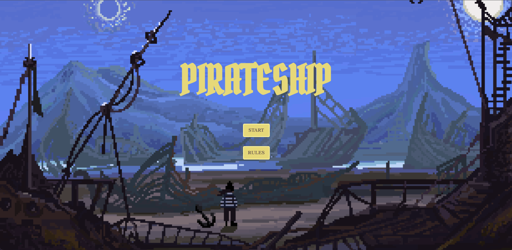
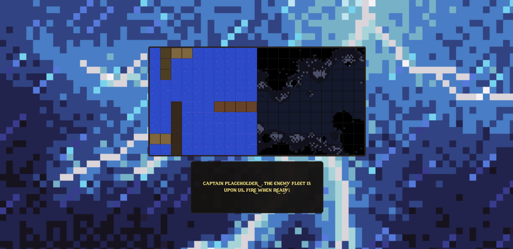
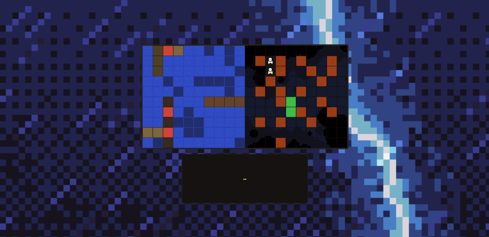
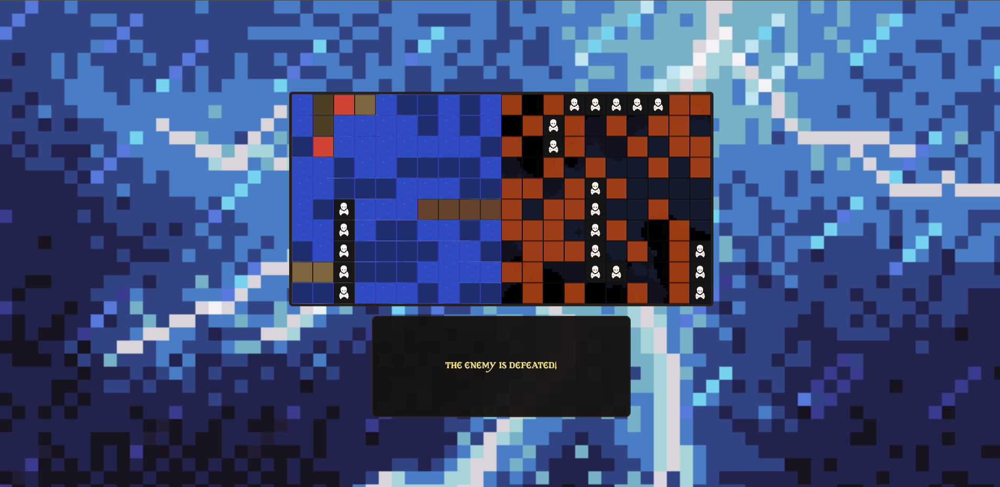
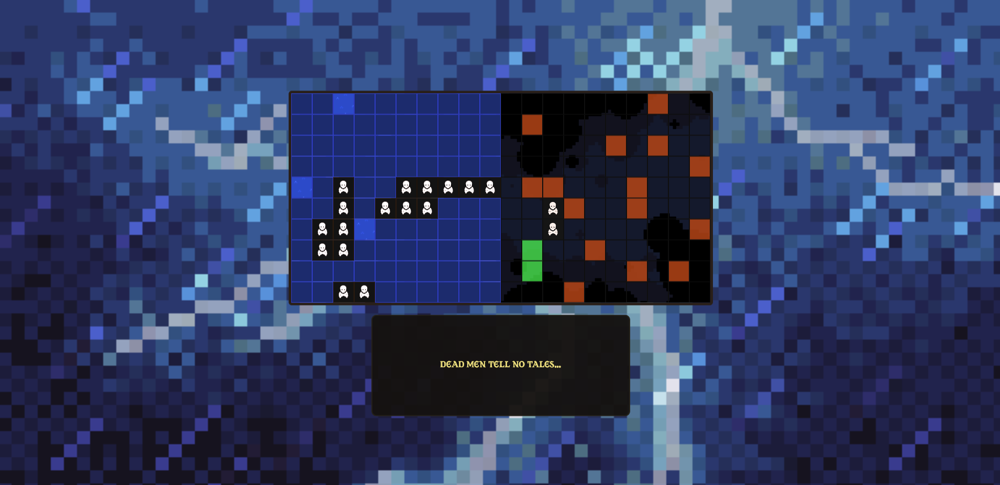

<PIRATESHIP>

# Description

A new take on the classic game of Battleship with pirate rules (if any). This game aims to bring you closer to the battle with fast paced combat and an immersive design approach. Command your crew and engage in unique battles across the seas!

# Rules
   
- Ship placement is randomized on both sides.
- The battle begins once you fire the first shot.
 - You are only limited by how fast your crew can fire the cannons.
- The first to sink all enemy ships is the winner.
- Sunk ships are marked with a skull and crossbones

# Pictures of Game:

# Play Game
    
https://nthconnor.github.io/battleship/

# Future Features
   
- User input for crew and captain name
- Ability to place ships where you want
 - A level system with unique environments and enemy types
 - A currency system
    - Upgrade weapons to unlock additional firing patterns
    - Upgrade ships to increase their size

# Technologies used
- HTML
- CSS
- Javascript
